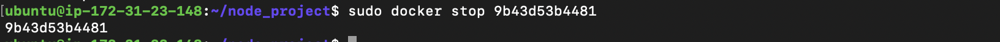

# Building-Nodejs-App-Docker

## Introduction

Welcome! In this project, we'll create an application image for a static website utilizing the [Express](https://expressjs.com/) and [Bootstrap](https://getbootstrap.com/) frameworks. We'll then build a container using that image and push it to [Docker Hub](https://hub.docker.com/) for future use. Finally, we'll pull the stored image from your Docker Hub repository and build another container, demonstrating how recreateable and scaleable our application is.

[Docker](https://www.docker.com/) allows developers to package and run applications as containers. A container is an isolated process that runs on a shared operating system, offering a lighter weight alternative to virtual machines.

When building and scaling an application for Docker, you'll want to start out by creating an application for that image, which will be ran in a container. The image includes your application code, libraries, configuration files, environment variables, and runtime. Using an image ensures that the environment in your container is standardized and contains only what is necessary to build and run your application.

Let's begin!

## Getting Started

To follow this tutorial, you will need:

- One Ubuntu 18.04 server, set up following this [Initial Server Setup](https://www.digitalocean.com/community/tutorials/initial-server-setup-with-ubuntu-18-04) guide.
- Docker installed on your server, following Steps 1 and 2 of [How To Install and Use Docker on Ubuntu 18.04](https://www.digitalocean.com/community/tutorials/how-to-install-and-use-docker-on-ubuntu-18-04).
- Node.js and npm installed, following [these instructions on installing with the PPA managed by NodeSource](https://www.digitalocean.com/community/tutorials/how-to-install-node-js-on-ubuntu-18-04#installing-using-a-ppa).
- A Docker Hub account. For an overview of how to set this up, refer to [this introduction](https://docs.docker.com/docker-hub/) on getting started with Docker Hub.

## Step One: Installing Application Dependencies

To create your image, you will first need to make your application files, which you can then copy to your container. These files will include your application’s static content, code, and dependencies.

Create a directory for your project in your non-root user’s home directory. The directory in this example named node_project, but you should feel free to replace this with something else:

    $ mkdir node_project


Navigate to the following directory:

    $ cd node_project

This will be the project's root directory.


Next, create a `package.json` file with the project's dependencies and other identifying information. Open the file with `nano` or your preferred editor:

    $ nano package.json


Add the following information about the project, including:
- name
- author
- license
- entrypoint
- dependencies

Be sure to replace the author information with your own name and contact details:

    {
    "name": "nodejs-image-demo",
    "version": "1.0.0",
    "description": "nodejs image demo",
    "author": "Belinda the Shark <belinda@example.com>",
    "license": "MIT",
    "main": "app.js",
    "keywords": [
        "nodejs",
        "bootstrap",
        "express"
    ],
    "dependencies": {
        "express": "^4.16.4"
    }
    }


Save and close the file by typing `CTRL + X`. Press `Y` and then `ENTER` to confirm your changes.

npm [advises](https://docs.npmjs.com/files/package.json#name) keeping your project name short and descriptive, avoiding duplicates in the [npm registry](https://www.npmjs.com/). 

Our example lists the [MIT license](https://opensource.org/licenses/MIT) in the license field, permitting the free use and distribution of the application code.

Furthermore, this file specifies: 

- `"main"`: The entrypoint for the application, `app.js`. You will create this file next.
- `"dependencies"`: The project dependencies — in this case, Express 4.16.4 or above.

**Note: While this file does not list a repository, you can add one by following these guidelines on adding a repository to your package.json file. This is a good addition if you are versioning your application.**

To install the project's dependencies, run the command below:

    $ npm install


This will install the packages you’ve listed in your package.json file in your project directory.

Let's now move on to building the application files!

## Step Two: Creating the Application Files

We'll create a website that offers users information about sharks. This application will have a main entrypoint, `app.js`, and a `views` directory that will include the project’s static assets. The landing page, `index.html`, will offer users some preliminary information and a link to a page with more detailed shark information, `sharks.html`. In the `views` directory, we will create both the landing page and `sharks.html`.

First, open `app.js` in the main project directory to define the project’s routes:

    $ nano app.js

In the first part of this file, create the Express application and Router objects and define the base directory and port as constants:

    $ const express = require('express');
    const app = express();
    const router = express.Router();

    const path = __dirname + '/views/';
    const port = 8080;


Save and close the file by typing `CTRL + X`. Press `Y` and then `ENTER` to confirm your changes.

The `require` function loads the `express` module, which is used to create the `app` and `router` objects. The `router` object will perform the routing function of the application, and as you define HTTP method routes you will add them to this object to define how your application will handle requests.

This section of the file also sets a couple of constants, `path` and `port`:

- `path`: Defines the base directory, which will be the `views` subdirectory within the current project directory.
- `port`: Tells the app to listen on and bind to port `8080`.

Set the routes for the application using the router object:

    ...

    router.use(function (req,res,next) {
    console.log('/' + req.method);
    next();
    });

    router.get('/', function(req,res){
    res.sendFile(path + 'index.html');
    });

    router.get('/sharks', function(req,res){
    res.sendFile(path + 'sharks.html');
    });

The `router.use` function loads a [middleware function](https://expressjs.com/en/guide/writing-middleware.html) that will log the router’s requests and pass them on to the application’s routes. These are defined in the subsequent functions, which specify that a `GET` request to the base project URL should return the `index.html` page, while a `GET` request to the /sharks route should return `sharks.html`.

Finally, mount the `router` middleware and the application’s static assets and tell the app to listen on port `8080`:

    ...

    app.use(express.static(path));
    app.use('/', router);

    app.listen(port, function () {
    console.log('Example app listening on port 8080!')
    })

The finished `app.js` file includes all of the following lines of code:


Save and close the file when you are finished.

Now, add some static content to the application. Start by creating the `views` directory:

    $ mkdir views

Open the landing page file, `index.html`:

    $ nano views/index.html

Adding the following code to the file will import Boostrap and create a [jumbotron](https://getbootstrap.com/docs/4.0/components/jumbotron/) component with a link to the more detailed `sharks.html` info page:

    <!DOCTYPE html>
    <html lang="en">

    <head>
        <title>About Sharks</title>
        <meta charset="utf-8">
        <meta name="viewport" content="width=device-width, initial-scale=1">
        <link rel="stylesheet" href="https://stackpath.bootstrapcdn.com/bootstrap/4.1.3/css/bootstrap.min.css" integrity="sha384-MCw98/SFnGE8fJT3GXwEOngsV7Zt27NXFoaoApmYm81iuXoPkFOJwJ8ERdknLPMO" crossorigin="anonymous">
        <link href="css/styles.css" rel="stylesheet">
        <link href="https://fonts.googleapis.com/css?family=Merriweather:400,700" rel="stylesheet" type="text/css">
    </head>

    <body>
        <nav class="navbar navbar-dark bg-dark navbar-static-top navbar-expand-md">
            <div class="container">
                <button type="button" class="navbar-toggler collapsed" data-toggle="collapse" data-target="#bs-example-navbar-collapse-1" aria-expanded="false"> <span class="sr-only">Toggle navigation</span>
                </button> <a class="navbar-brand" href="#">Everything Sharks</a>
                <div class="collapse navbar-collapse" id="bs-example-navbar-collapse-1">
                    <ul class="nav navbar-nav mr-auto">
                        <li class="active nav-item"><a href="/" class="nav-link">Home</a>
                        </li>
                        <li class="nav-item"><a href="/sharks" class="nav-link">Sharks</a>
                        </li>
                    </ul>
                </div>
            </div>
        </nav>
        <div class="jumbotron">
            <div class="container">
                <h1>Want to Learn About Sharks?</h1>
                <p>Are you ready to learn about sharks?</p>
                <br>
                <p><a class="btn btn-primary btn-lg" href="/sharks" role="button">Get Shark Info</a>
                </p>
            </div>
        </div>
        <div class="container">
            <div class="row">
                <div class="col-lg-6">
                    <h3>Not all sharks are alike</h3>
                    <p>Though some are dangerous, sharks generally do not attack humans. Out of the 500 species known to researchers, only 30 have been known to attack humans.
                    </p>
                </div>
                <div class="col-lg-6">
                    <h3>Sharks are ancient</h3>
                    <p>There is evidence to suggest that sharks lived up to 400 million years ago.
                    </p>
                </div>
            </div>
        </div>
    </body>

    </html>


Here's what the various elements in our `index.html` file does:

- The top-level [navbar](https://getbootstrap.com/docs/4.0/components/navbar/) allows users to toggle between the **Home** and **Sharks** pages.
- In the `navbar-nav` subcomponent, you are using Bootstrap’s `active` class to indicate the current page to the user.
- We've also specified the routes to your static pages, which match the routes you defined in `app.js`:


Additionally, we’ve created a link to our shark information page in our jumbotron’s button:


There is also a link to a custom style sheet in the header:


We'll create this style sheet at the end of this step.

Save and close the file once finished. 

With the application landing page in place, we can create our shark information page, sharks.html, which will offer interested users more information about sharks.

Open the file:

    $ nano views/sharks.html

Add the following code, which imports Bootstrap, the custom style sheet, and detailed information about certain sharks:

    <!DOCTYPE html>
    <html lang="en">

    <head>
        <title>About Sharks</title>
        <meta charset="utf-8">
        <meta name="viewport" content="width=device-width, initial-scale=1">
        <link rel="stylesheet" href="https://stackpath.bootstrapcdn.com/bootstrap/4.1.3/css/bootstrap.min.css" integrity="sha384-MCw98/SFnGE8fJT3GXwEOngsV7Zt27NXFoaoApmYm81iuXoPkFOJwJ8ERdknLPMO" crossorigin="anonymous">
        <link href="css/styles.css" rel="stylesheet">
        <link href="https://fonts.googleapis.com/css?family=Merriweather:400,700" rel="stylesheet" type="text/css">
    </head>
    <nav class="navbar navbar-dark bg-dark navbar-static-top navbar-expand-md">
        <div class="container">
            <button type="button" class="navbar-toggler collapsed" data-toggle="collapse" data-target="#bs-example-navbar-collapse-1" aria-expanded="false"> <span class="sr-only">Toggle navigation</span>
            </button> <a class="navbar-brand" href="/">Everything Sharks</a>
            <div class="collapse navbar-collapse" id="bs-example-navbar-collapse-1">
                <ul class="nav navbar-nav mr-auto">
                    <li class="nav-item"><a href="/" class="nav-link">Home</a>
                    </li>
                    <li class="active nav-item"><a href="/sharks" class="nav-link">Sharks</a>
                    </li>
                </ul>
            </div>
        </div>
    </nav>
    <div class="jumbotron text-center">
        <h1>Shark Info</h1>
    </div>
    <div class="container">
        <div class="row">
            <div class="col-lg-6">
                <p>
                    <div class="caption">Some sharks are known to be dangerous to humans, though many more are not. The sawshark, for example, is not considered a threat to humans.
                    </div>
                    
                </p>
            </div>
            <div class="col-lg-6">
                <p>
                    <div class="caption">Other sharks are known to be friendly and welcoming!</div>
                    
                </p>
            </div>
        </div>
    </div>

    </html>

Once again, we use the `active` Bootstrap class to indicate the current page.


Save and close the file when finished.

Lastly, create the custom CSS style sheet that we linked to in `index.html` and `sharks.html` by creating a `css` folder in the `views` directory:

    $ mkdir views/css


Open the style sheet:

    $ nano views/css/styles.css

The following code will set the desired color and font for our pages:

    .navbar {
        margin-bottom: 0;
    }

    body {
        background: #020A1B;
        color: #ffffff;
        font-family: 'Merriweather', sans-serif;
    }

    h1,
    h2 {
        font-weight: bold;
    }

    p {
        font-size: 16px;
        color: #ffffff;
    }

    .jumbotron {
        background: #0048CD;
        color: white;
        text-align: center;
    }

    .jumbotron p {
        color: white;
        font-size: 26px;
    }

    .btn-primary {
        color: #fff;
        text-color: #000000;
        border-color: white;
        margin-bottom: 5px;
    }

    img,
    video,
    audio {
        margin-top: 20px;
        max-width: 80%;
    }

    div.caption: {
        float: left;
        clear: both;
    }

In addition to setting font and color, this file also limits the size of the images by specifying a max-width of 80%. This will prevent the pictures from taking up more room than you would like on the page.


Save and close the file when finished.

With the application files in place and the project dependencies installed, we're ready to start the application!

If you followed the initial server setup tutorial in the prerequisites, you will have an active firewall permitting only SSH traffic. To permit traffic to port 8080 run:

    $ sudo ufw allow 8080


To start the application, make sure that you are in your project’s root directory:

    $ cd ~/node_project


Start the application with `node app.js`:

    $ node app.js


Navigate your browser to `http://your_server_ip:8080`. Your landing page should look like this:


Clicking on the **Get Shark Info** button will direct you to the following information page:


Amazing! We now have an application that's running. Once you are ready, quit the server by typing `CTRL + C`. 

Now, let's move on to creating the Dockerfile that will allow you to recreate and scale this application as desired.

## Step Three: Writing the Dockerfile

The Dockerfile specifies what will be included in our application container when it is executed. Using a Dockerfile allows us to define our container environment and avoid discrepancies with dependencies or runtime versions.

Following [these guidelines on building optimized containers](https://www.digitalocean.com/community/tutorials/building-optimized-containers-for-kubernetes), will make our image as efficient as possible by minimizing the number of image layers and restricting the image’s function to a single purpose — recreating our application files and static content.

In your project’s root directory, create the Dockerfile:

    $ nano Dockerfile

Docker images are created using a succession of layered images that build on one another. Our first step will be to add the *base image* for our application that will form the starting point of the application build.

You can use the `node:10-alpine`[image](https://hub.docker.com/_/node/). The `alpine` image is derived from the [Alpine Linux](https://alpinelinux.org/) project, and will help keep your image size down. For more information about whether or not the `alpine` image is the right choice for your project, please see the full discussion under the **Image Variants** section of the [Docker Hub Node](https://hub.docker.com/_/node/) image page.

Add the following `FROM` instruction to set the application’s base image:


This image includes Node.js and npm. Each Dockerfile must begin with a `FROM` instruction.

By default, the Docker Node image includes a non-root **node** user that you can use to avoid running your application container as **root**. It is a recommended security practice to avoid running containers as root and to [restrict capabilities within the container](https://docs.docker.com/engine/security/security/#linux-kernel-capabilities) to only those required to run its processes. We will therefore use the **node** user’s home directory as the working directory for our application and set them as our user inside the container. For more information about best practices when working with the Docker Node image, see this [best practices guide](https://github.com/nodejs/docker-node/blob/master/docs/BestPractices.md).

To fine-tune the permissions on your application code in the container, create the `node_modules` subdirectory in `/home/node` along with the `app` directory. Creating these directories will ensure that they have the correct permissions, which will be important when you create local node modules in the container with `npm install`. In addition to creating these directories, set ownership on them to your **node** user:


For more information on the utility of consolidating `RUN` instructions, see this [discussion of how to manage container layers](https://www.digitalocean.com/community/tutorials/building-optimized-containers-for-kubernetes#managing-container-layers).

Next, set the working directory of the application to `/home/node/app`:


If a `WORKDIR` isn’t set, Docker will create one by default, so it’s a good idea to set it explicitly.

Next, copy the `package.json` and `package-lock.json` (for npm 5+) files:


Adding this `COPY` instruction before running `npm install` or copying the application code allows you to take advantage of Docker’s caching mechanism. At each stage in the build, Docker will check to see if it has a layer cached for that particular instruction. If you change the `package.json`, this layer will be rebuilt, but if you don’t, this instruction will allow Docker to use the existing image layer and skip reinstalling your node modules.

To ensure that all of the application files are owned by the non-root **node** user, including the contents of the `node_modules` directory, switch the user to **node** before running `npm install`:


After copying the project dependencies and switching the user, run `npm install`:


Next, copy your application code with the appropriate permissions to the application directory on the container:


This will ensure that the application files are owned by the non-root **node** user.

Finally, expose port `8080` on the container and start the application:


`EXPOSE` does not publish the port, but instead functions as a way of documenting which ports on the container will be published at runtime. `CMD` runs the command to start the application — in this case, `node app.js`.

**NOTE:** There should only be one CMD instruction in each Dockerfile. If you include more than one, only the last will take effect.

There are many things you can do with the Dockerfile. For a complete list of instructions, please refer to Docker’s [Dockerfile reference documentation](https://docs.docker.com/engine/reference/builder/).

This is the complete Dockerfile:


Save and close the file when you are finished editing.

Before building the application image, add a `.dockerignore` [file](https://docs.docker.com/engine/reference/builder/#dockerignore-file). Working in a similar way to a `.gitignore` [file](https://git-scm.com/docs/gitignore), `.dockerignore` specifies which files and directories in your project directory should not be copied over to your container.

Open the `.dockerignore` file:

    $ nano .dockerignore

Inside the file, add your local node modules, npm logs, Dockerfile, and `.dockerignore` file:

    node_modules
    npm-debug.log
    Dockerfile
    .dockerignore


If you are working with [Git](https://git-scm.com/) then you will also want to add your `.git` directory and `.gitignore file`.

Save and close the file when you are finished.

You are now ready to build the application image using the [`docker build`](https://docs.docker.com/engine/reference/commandline/build/) command. Using the `-t` flag with `docker build` will allow you to tag the image with a memorable name. Because you’re going to push the image to Docker Hub, include your Docker Hub username in the tag. You can tag the image as ```nodejs-image-demo```, but feel free to replace this with a name of your own choosing. Remember to also replace ```your_dockerhub_username``` with your own Docker Hub username:

    $ docker build -t your_dockerhub_username/nodejs-image-demo .


The `.` specifies that the build context is in the current directory.

**NOTE:** If you receive a permission denied message, ensure that you have `sudo` in the beginning of the command.


It may take some time for the new image to be built; Once it's complete, check your images:

    $ docker images


It's now possible to create a container with this image using `docker run`. We'll incorporate three flags with this command:

- -p: This publishes the port on the container and maps it to a port on your host. You can use port 80 on the host, but you should feel free to modify this as necessary if you have another process running on that port. For more information about how this works, see this discussion in the Docker docs on [port binding](https://docs.docker.com/config/containers/container-networking/).
- -d: This runs the container in the background.
- --name: This allows you to give the container a memorable name.

Run the command below to bulild the container:

    $ docker run --name nodejs-image-demo -p 80:8080 -d your_dockerhub_username/nodejs-image-demo


Once the container is running, you can run the following command to inspect a list of your running containers:

    $ docker ps


With your container running, you can now visit your application by navigating your browser to `http://your_server_ip`:


We have successfully created an image for our application! We can push it to Docker Hub for future use.

## Step Four: Using a Repository to Work with Images

By pushing our application image to a registry like Docker Hub, we make it available for subsequent use as we build and scale our containers. To demonstrate how this works, we will push the application image to a repository and then use the image to recreate our container.

The first step to pushing the image is to log in to the Docker Hub account we created in the prerequisites:

    $ docker login -u your_dockerhub_username

When prompted, enter your Docker Hub account password. Logging in this way will create a `~/.docker/config.json` file in your user’s home directory with your Docker Hub credentials.

You can now push the application image to Docker Hub using the tag you created earlier, `your_dockerhub_username/nodejs-image-demo`:

    $ docker push your_dockerhub_username/nodejs-image-demo


Let’s test the utility of the image registry by destroying our current application container and image and rebuilding them with the image in our repository.

First, list your running containers:

    $ docker ps


Using the `CONTAINER ID` listed in your output, stop the running application container. Be sure to replace the highlighted ID below with your own `CONTAINER ID`:

    $ docker stop e50ad27074a7



List your all of your images with the -a flag:

    $ docker images -a


The following is output with the name of your image, your_dockerhub_username/nodejs-image-demo, along with the node image and the other images from your build:


Remove the stopped container and all of the images, including unused or dangling images, with the following command:

    $ docker system prune -a


Type y when prompted in the output to confirm that you would like to remove the stopped container and images. Be advised that this will also remove your build cache.


We have now removed both the container running your application image and the image itself! For more information on removing Docker containers, images, and volumes, check out [How To Remove Docker Images, Containers, and Volumes](https://www.digitalocean.com/community/tutorials/how-to-remove-docker-images-containers-and-volumes).

With all of your images and containers deleted, you can now pull the application image from Docker Hub:

    $ docker pull your_dockerhub_username/nodejs-image-demo


List your images once again:

    $ docker images

You will see your application image:


You can now rebuild your container using the command from Step 3:

    $ docker run --name nodejs-image-demo -p 80:8080 -d your_dockerhub_username/nodejs-image-demo


List your running containers:

    $ docker ps


Once again, visit http://your_server_ip to view your running application.


## Conclusion

Well done! We created a static web application with Express and Bootstrap, as well as a Docker image for this application. We were able to use this image to create a container and pushed the image to Docker Hub. From there, we were able to destroy our image and container and recreate them using our Docker Hub repository.

